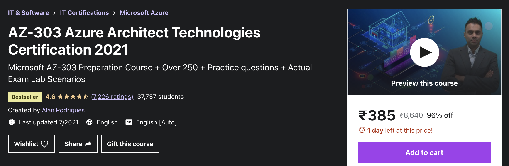

On August 16, 2021, I successfully completed the requirements to be recognized as a [Microsoft Certified: Azure Solutions Architect Expert](https://www.credly.com/badges/547e9d3b-9988-4d9b-85d2-1af784a86776/public_url). I wanted to share my experience around preparing for the exam and the challenges.

Last year (November 5, 2020) I completed Google Cloud Professional Cloud Architect certification and I also shared my experience in a [different article](https://jawahar.tech/blog/how-i-cleared-gcp-pca-certification-exam/). GCP Certification has one exam to get the certificate, whereas you need to pass below two exams to clear Azure Architect Certification. 

- [AZ-303: Microsoft Azure Architect Technologies](https://docs.microsoft.com/en-us/learn/certifications/exams/az-303)
- [AZ-304: Microsoft Azure Architect Design](https://docs.microsoft.com/en-us/learn/certifications/exams/az-304)

The above two exams assess different set of skills. The exam skills outline and the learning path is very clearly defined in the official website (link above) and got updated whenever there is a change. 

AZ-303 looks for detailed implementation skills, like - what are the mandatory sections in an ARM template, what address range to choose to avoid IP overlapping, which section to be checked to verify the recent infra deployments, etc. They look for a detailed understanding on the implementation of Azure Services. 

AZ-304 focuses mostly on the design part. Like - on a hub spoke model, where do you implement the firewall, fill the missing pieces in a typical n-tier architecture (yes you have to drag and drop the answers 😀), what is the minimum number of key vaults required for the given business requirement, etc. The exam expects sound knowledge on system design and Azure infrastructure.

## Learning path

Since this is an Expert level certificate (other levels are available like Associate and Fundamentals), the exam covers a vast number of topics in Azure. And Azure is already a very sophisticated cloud provider and offers a lot (really a lot !! 😱) of services. So it is needed to have a good understanding of all those services. 

For AZ-303, it is good to have some actual hands-on experience in Azure, since most of the questions are very detailed around implementation. An azure account can be created for free and it provides few all time free services and few 12 months free services. Also it gives a credit of $200 for the first month. 

https://azure.microsoft.com/en-in/free/

I created an account and did some hands-on practices. After the first month, make sure you keep track of your spendings and stop the services after you experiment. Also I was actually working on a client project and Azure is the cloud provider. That makes my life easier , since I worked primarily with infrastructure in that project.

There are a lot of online courses available for Azure exams. I took one on Udemy, curated by Alan Rodrigues. I am sure this is one of the most comprehensive courses available for Azure 303 and 304 exams. The course has around 27 hours of content and Alan explains each concept with nice visualizations and hands-on sessions. He has another course on AZ-304 as well, which is also really nice.

Another best way to prepare for these exams is to go through Microsoft Azure official documentation. Especially focus on the FAQs, or sections with topics "When to use XXXX service?" or a note with the title "Important". Most questions in exams touch these areas.

## Exam experience

The exam can be taken in a center or online. I always prefer to take these exams in a center rather than taking it at home through an online proctor. Taking the exam at home has a few challenges like - you need a clean desk, no firewalls in your laptop, scan the room with a camera and to the worst what if the internet fails in the middle. In a testing center, the infrastructure and the environment is taken care of by the test officials and you just need to focus on the exam. Also make sure to call the center before booking the slot, since some centers might be closed because of the pandemic.

Once you complete the tests, you will get the report right away with the result of PASS or FAIL and a detailed split of your performance on different areas (unlike Google exams 😜). This gives a good idea on where you need to improve and where your strength is.

## Exam format

The exam has multiple choice questions and the number of questions typically vary I believe. I got 52 questions for AZ-303 and 61 questions for AZ-304 with a time limit for 150 minutes. 

The exam also contains case studies, which are the most difficult part of the exam. Unlike GCP, these case studies are not released to you prior to the exam. And no separate time will be given to read and understand the case studies (horrible... 🙄). Multiple questions will be given based on the case studies and the answers are usually hidden in one small requirement in the 3 to 4 paragraph long case study. Make sure you read and understand the case study clearly before jumping to questions. Time is crucial in these exams. So mark the questions for review, if you have doubts and move on to other questions. 

Good luck.

