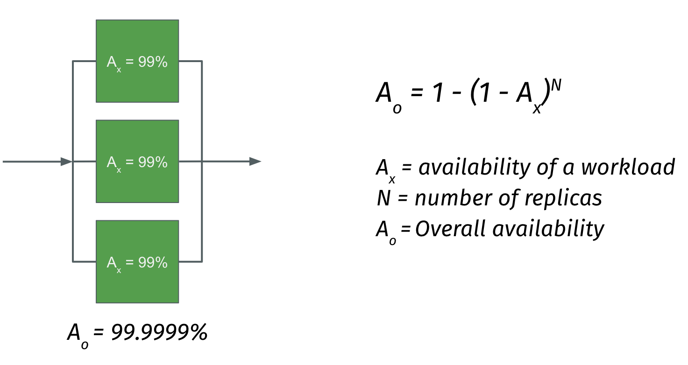

Redundancy is one of the common approach to provide resiliency to a system. So it means you're actually duplicating the system components. So that in case if one component fails, the other can take the responsibility. Redundancy can be divided into two types, one is active-passive and another one is active-active. In case of active-passive one workload will be active, which is actually performing all the tasks and there is another workload that will be in passive state. In case of active-active both will be performing the task. So the major difference between these two models is - in case of active-passive model if the active workload goes down, there will be a manual intervention required to make the passive one active. But in case of active-active model, if one node goes down, the system will continue to operate without any issues. It looks like that the active-active model is more efficient here. But the decision between these two models has to be taken based on the business requirement. 

  

So for example, let's consider we are doing a website development and it requires two different environments - one is authoring environment and another one is consumer environment. Authoring environment is used by the content authors internally to upload the content to the system. The consumer environment is where the end users will be consuming the content.

  

So if you look at this diagram, we are using active-passive model for the authoring environment and active-active model for the consumer environment. The decision is because, it is not mission critical if authoring instance goes down. It wouldn't impact the business much because it is for internal use and the users also hardly 50 to 100 users only (vary based on organisation). So a little downtime is acceptable in this case. But in case of consumer environment, the real website environment, no downtime is acceptable. So in case if the instance goes down, it will directly impact the business. And hence the active-active model would be the right choice. So the decision between these two model actually depends on the business needs. 

And it looks like there is a very common understanding that if you duplicate the components in a system, it will automatically increase the availability. But it is [mathematically proven](https://www.eventhelix.com/RealtimeMantra/FaultHandling/system_reliability_availability.htm). 

  

Consider two workloads connected in parallel, and each workload has an availability of 99%. Actually 99% is not a good uptime, because it actually leads to some three days of downtime every year. But consider that these two workloads connected in parallel. According to this formula, the overall availability will become 99.99%, which is a very good availability for the system. And it is more than that compared to the individual availability. The biggest advantage with this approach is if you just increase the replicas, the overall availability will increase much.

  

Another thing to consider in this case is whenever we do the system design, not all the redundant architecture are resilient. So you can design a redundant architecture, but that doesn't mean it is resilient. I can explain that with a simple example.

Consider there are two buildings. And these two buildings are actually connected by a wire under the ground. And consider we want to implement the redundancy pattern here. So we just duplicate the wire, so that in case if one goes down, the other one will take care of the system. Also the wire has to be intact for the buildings to operate. Now, one day, suddenly someone actually dig a hole in the neighbourhood and they just break both wires at the same time, the whole system will go down. So this is the reason I'm telling that the system can be redundant, but it doesn't mean that it is highly resilient. The highly resilient system would look something like this. 

  

You put one wire above the ground and another wire below the ground. If the same issue happens and the wire that is under the ground goes down, the system will continue to work. The point is the system shouldn’t go down from a single source of failure. 

  

Typically, in software architecture, especially in the cloud environment, we usually apply redundancy by duplicating the number of workloads that we use. If you look at the diagram, these workloads running inside a virtual machine. So now we have to think about the fact what happens if the virtual machine goes down that will put the whole system down right. So it is always a best practice to distribute your workloads across the virtual machines. So that in case if one machine goes down, other machine will take care of the system responsibility. 

  

But again, if you look at the virtual machine has to run in some kind of a data centre. Basically, data centre is a place where your cloud provider actually keep all the configuration and your virtual machine might be running in one of the datacenter. Now the thing is what if the datacenter goes down, your whole system will again go down right. So it is a best practice to distribute the virtual machines across the datacenter. But most of the cloud providers do not provide you an option to choose the data centre. But they provide another option called availability zone. So you can choose an availability zone where you want to deploy those machines. 

The availability zone may not directly mapped to the data centre. Usually, availability zone can have more than one or two data centres as well. But the thing that we have to keep in mind here is these zones are actually located far from each other. So that if something happens in one zone, it will not impact the other zone. And at the same time, these zones are connected with high speed network for enabling high speed replication. 

  

And in some cases, the cloud providers logically group these availability zones under region. And some applications consider this multi region infrastructure. That is a good one. But it also has some downsides like the cost will be too high, and the replication will be slower. 

  

Also regional failure is a rare scenario - it's not a thing that happen often. And one of the good example for multi region redundancy model is the CDN service. CDN has multiple edge locations around the globe. It serves the content to the users without any latency. But CDN also gives some advantages from the resiliency point of view as well. In case if the origin server goes down, the content will be still served to the users without any downtime for some period, because the content will be cached in all these edge locations. Though there are lot of options available for redundancy, the option has to be chosen based on business requirements.

