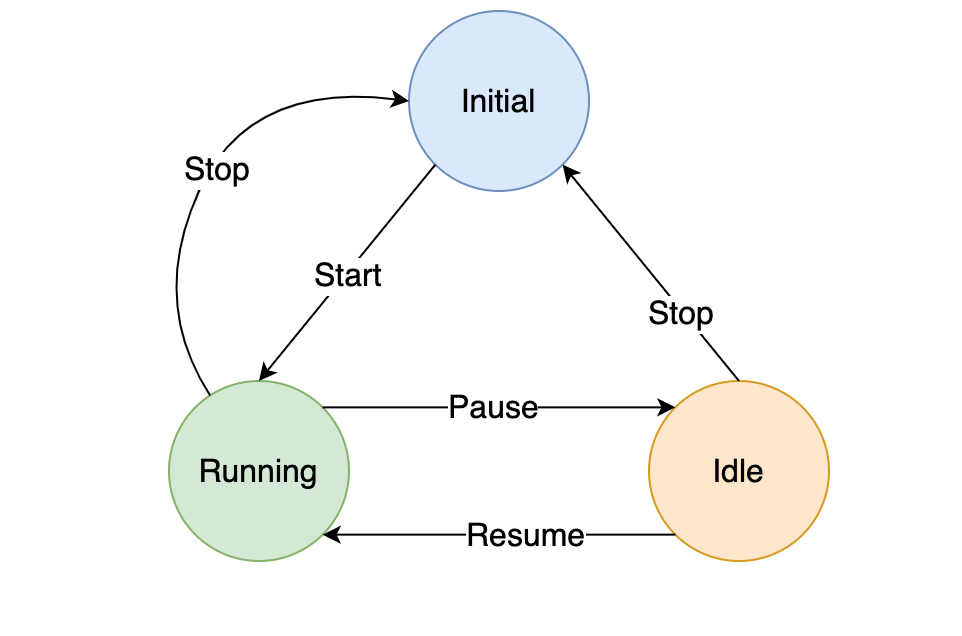

Have you ever worked with a system, where it often end up in an unexpected state? For example, how about displaying both play and pause button at the same time in a media player. What about both red and green lights glowing at the sme time or an orange light turns to green in a traffic light system. These unexpected states are usually the result of poor handling of state transitions. A system must have a predefined set of states. The state of a system gets transferred to another state based on a certain external action. These transition between those states and actions those causing them should be clearly defined.

> A finite state machine (sometimes called a finite state automaton) is a computation model that can be implemented with hardware or software and can be used to simulate sequential logic and some computer programs.

Finite State Machine helps a lot in User Interface flow. xstate is a popular dart library to create a state machine. It can be used along with modern libraries like React or Vue for maximum efficiency. In this article I would like to create a simple state machine implementation in Flutter.

Flutter is cross platform native mobile application development tool, powered by Dart programming language. The reason I picked Flutter to try this State Machine is - Flutter - similar to React uses declarative approach, not just to define the UI, but also the logic (state) for the UI. Flutter community recommends several approaches for state management in Flutter applications like Provider or BLoC. For simplicty I am going to stick to basic stateful widget to showcase our state machine implementation.

Consider we have to build a simple stopwatch. It runs on clicking the start button and has options to pause/resume or stop the timer. Following is the simple state diagram for stopwatch state machine.



The number of states and transitions are clearly defined.

**Initial** - This is the initial state that represents timer 0 seconds.

**Running** - This is the active state of timer.

**Idle** - The is the passive state of timer. The timer is just paused.

It is clear from the diagram, that from the initial state, the only possible next state is running and similar rules are there for other states also. These kind of constraints helps us to reduce bugs in state transition.

Dart is a static typed language, so we can create separate types to represent State and Transitions.

###State

A state entity should define its transition nature. A state can have multiple transitions. From the diagram, the running state has two transitions - to initial and to idle. We consider only forward transitions, that implies our state is the source and any transition will result in a target state.

```dart
class State {
  List<Transition> transitions;
  State(this.transitions);
}
```

###Transition

Lets look at Transition entity. Transition has to define the target state and the action that causes it.

```dart
class Transition {
  String action;
  String targetState;
  Transition({@required this.action, @required this.targetState});
}
```

I annotate action and ```targetState``` as required explicitly, since named parameters are optional in Dart. And I need those parameters as named for better readability, when we define our state machine, which we will do it in a while.

###State Machine
State machine represents a collection of states and each state represents a collection of transitions. It also has another attribute to store the initial state. Current state of the machine has to exposed public, since we need this information in our widget to specify UI changes based on the state.

```dart
class StateMachine {
  Map<String, State> _states;
  String _currentState;
  
  String get currentState => _currentState;

  StateMachine(states, String initialState) {
    this._states = states;
    this._currentState = initialState;
  }
}
```

We declared our state list as a hashmap. That's an added advantage when compared to the classic model of state machine using switch case. In switch-case it has to evaluate a certain set of conditions to find the right state, whereas thats not the case with hashmap.

But this is just an object model. It also required a function to make a transition from one state to another. The function accepts an action parameter and based on that it decides the next state.

```dart
void transition(String action) {
  this._currentState = this
      ._states[_currentState]
      .transitions
      .firstWhere((t) => t.action == action)
      .targetState;
}
```

The function is not doing any complex stuff. From the list of current state's transitions, it identify the right one based on the action and return its target state.

###Stopwatch State Machine
Now the state machine implementation is ready, let's define our states for stopwatch.

```dart
var stopwatchStateMachine = StateMachine({
  'running': State([
    Transition(action: 'pause', targetState: 'idle'),
    Transition(action: 'stop', targetState: 'initial')
  ]),
  'idle': State([
    Transition(action: 'start', targetState: 'running'),
    Transition(action: 'stop', targetState: 'initial')
  ]),
  'initial': State([
    Transition(action: 'start', targetState: 'running')
  ])
}, 'initial');
```

The hash of states and an initial state has been given as input to the state machine. And whenever we call the transition function, it compute the next state. Now it is just matter of define our UI based on the current state.

```dart
List<Widget> buttons() {
  if (timerState.currentState == 'idle') {
    return [
      ActionButton('Resume', () => _onAction('start')),
      ActionButton('Stop', () => _onAction('stop'))
    ];
  } else if (timerState.currentState == 'running') {
    return [
      ActionButton('Pause', () => _onAction('pause')),
      ActionButton('Stop', () => _onAction('stop'))
    ];
  } else if (timerState.currentState == 'initial') {
    return [ActionButton('Start', () => _onAction('start'))];
  }

  return null; // Just to avoid warning
}
```

The button panel has been decided based on the current state. With this implementation, we made sure hat we never end up in an unexpected state. In a classical approach, we would have introduced couple of boolean flags in our state and make decisions based on that. That code might get complex when new states and actions introduced. But adding a new state to the state machine is an easy task.

If you notice every button press calls the same _```onAction``` function with different action parameters. This is where we actually call the transition function of state machine.

```dart
void _onAction(String action) {
  this.setState(() => this.timerState.transition(action));
}
```

We do that in setState function, so that it automatically updates our UI widgets, whichever depends on the current state.

##Closing
This is a very minimal and simple implementation of State Machine. The implementation can be extended to support various features like hierarchical states and history tracking. Sometimes during development, I often consider state transitions as trivial, but as the complexity grows and number of new states gets introduced, I realised that it is always good to have a dedicated system like state machine to manage the states and its transitions.

The example explained in this article is available in this [git repository](https://github.com/jawahars16/finite-state-machine-flutter).