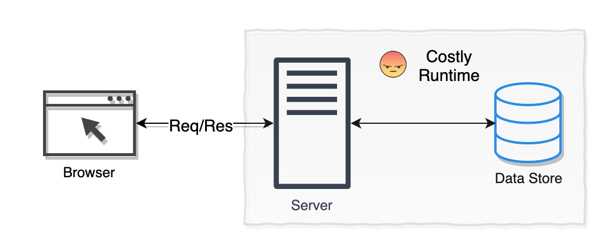
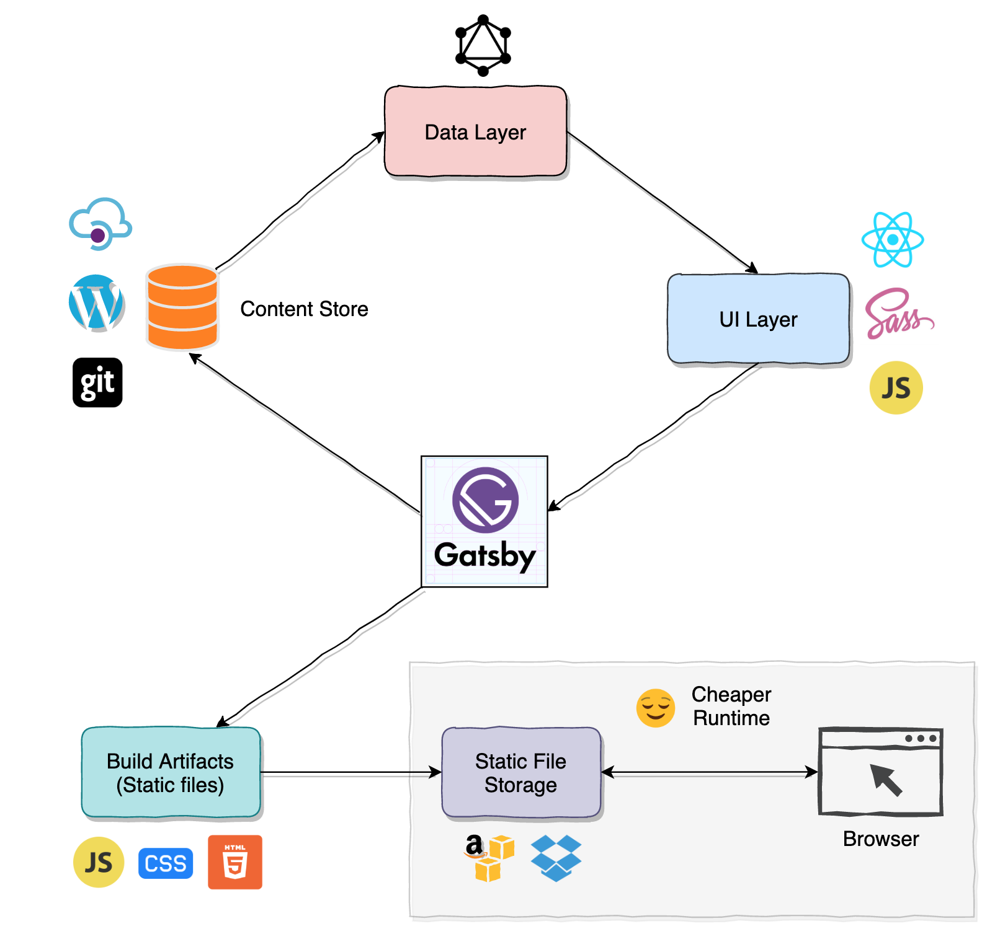

Gatsby is an open source framework. And it used to build blazing fast websites using modern technologies like React and GraphQL. Gatsby is recently becoming the default solution to build static websites. 

## The problem

Before we jump into the details about Gatsby, we want to understand the limitations with traditional web development approach. In a traditional way browser sends request to the backend server. The server process the requests and decide what content it needs to serve.  The server application then requests data from the backend data store. The server application will then use the data to construct the HTML page and deliver it back to the browser. The browser renders the HTML page to the user. This is how a traditional web application works. But If you observe closely, you would realise that all these workflow happens during runtime. Handling the user request, fetching the content from data store and constructing the HTML page, everything happens at runtime. And that definitely affects the performance.

Performance is one of the most critical thing in website development. Faster websites can make humans and Google bots happy. Usually developers have to put considerable effort to make the website faster. They need to understand the technology better to do that. For example a very good understanding of non blocking IO and concurrency is required to write CPU efficient code. Application developers usually don’t want to spend time on that, instead they want to focus on business problems.

Scalability is another pain. When your site gets more traffic and the existing infrastructure is not capable of handling it, you should be worrying about scaling up the infrastructure. And also you have to scale it down when traffic goes down. It requires a continuous monitoring and management to make the website highly available.

## Gatsby, the saviour

Gatsby came up with the idea of constructing the HTML pages ahead of time. That reduces the cost of doing heavy computations at runtime. Unlike any other static site generators, Gatsby uses modern web development technologies like React, GraphQL and Webpack. 

Let's see how Gatsby works in a high level. Gatsby fetches content from the data store. Data store could be a GIT repository, a REST api or a headless CMS. There are many options for loading data into React components. One of the most popular approach is to use GraphQL. React components declare the data they need in the form of GraphQL query. Gatsby now construct HTML pages from React components. And these HTML pages along with JavaScript and CSS will be uploaded to a static file storage server like AWS S3. Since all the HTML pages are already built and available at runtime, the website would now perform 10x times faster than a traditional web application. When content gets updated in the backend data store, the build process should be triggered again and a fresh set of assets will be deployed to the server.

 

Gatsby also came up with a rich set of plugins that provides a great development experience.
With simple nam install and few configuration changes, rich set of features can be integrated into your website. 
Since HTML pages are pre built with Gatsby, the cost of deploying and serving them are cheaper compared to traditional web applications.
Gatsby can provide offline support as well, transforming your site into a full-blown Progressive Web App.

So in a nutshell if you want to build a static website using modern technologies like React and GraphQL, Gatsby is the better approach. 