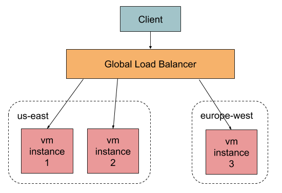
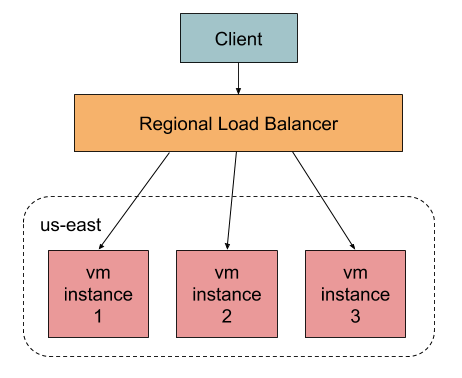
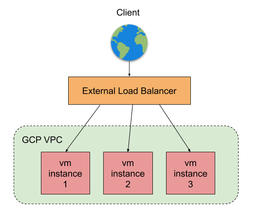
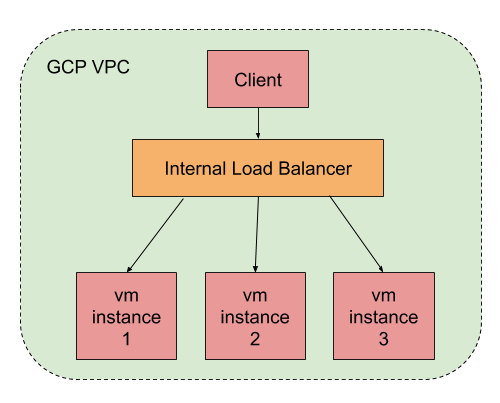
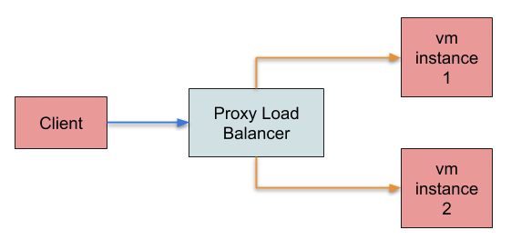
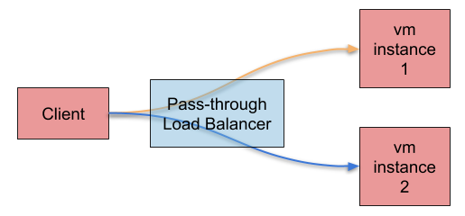
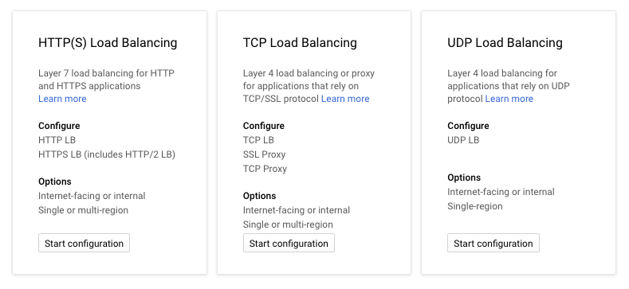

GCP Load balancers are the most interesting topic when you start learning Google Cloud Platform. There are different types of load balancers available and understanding them would help us to decide the right load balancer for the right purpose. These load balancer types are derived from several criteria. In this article, I am going to talk about those different criteria that make up the load balancer types.

Load Balancers are basically a system that distributes the network traffic to different instances to avoid overburdening the system. Though that is the primary function of a load balancer, it also acts as a CDN, network proxy, and a shield. The following are the different criteria that GCP uses to classify the load balancing options.
    
1. Global or Regional
2. External or Internal
3. Traffic types (TCP or UDP)
4. Proxy-based or Pass-through

## Global or Regional
A global load balancer (LB) helps to distribute the network traffic to virtual machines that are spread across different regions, whereas a regional LB distributes the network traffic to virtual machines within a single region.

Consider you're building an application that needs a global presence - like a marketing website. It gets visitors from all over the world, so we basically distribute virtual machines all over the world to avoid latency. The global load balancer is the right choice here - it helps to route your traffic to the nearby server. 

On the other side, a regional load balancer would be useful if you prefer to restrict the servers in a single region. For example, you started a restaurant and you are looking for an online presence to support home delivery. In this case, you prefer to create servers in the same region where your restaurant is. To improve performance, you might want to create more servers in that region and you can also spread it across different zones to avoid zonal failures. In this case, a regional load balancer is a right choice, which distributes the network across virtual machines in the same region.

## External or Internal
An external load balancer drives traffic from the public internet into your GCP network, whereas an internal load balancer drives traffic within your GCP network. The example we just discussed above (marketing website or a restaurant home delivery portal) are very good examples of external load balancers.

Consider you have a 3-tier architecture (UI, Service, and Database) and you want to improve the performance and use the resources efficiently. A load balancer can be introduced in between these tiers and drives the traffic across the servers.

### Traffic types
GCP load balancer supports different types of network traffic as listed below.

* HTTP
* HTTPS
* TCP without SSL
* TCP with SSL
* UDP

In the GCP Console, you have two different options to configure HTTP(S) based LB and TCP based LB. HTTP(S) based is layer 7 LB, whereas TCP based is layer 4 LB. SSL certificates can be configured to make a TCP LB secure. Several other features like Cloud CDN, Cloud Armor, and advanced redirect/rewrite rules are available only to HTTP(S) based LB.

### Points to remember

* External HTTP(S) LBs are always global.
* Internal LBs are always regional, no matter what traffic type it is.
* UDP LBs are always regional.

## Proxy-based or Pass-through
A GCP load balancer can be proxy-based, in which a network request ends at the load balancer and a new request will be created to reach the backend service. In this case, SSL termination happens at the load balancer and the new request to backend service may not be encrypted. Also, the backend instances will not get the client IP details, so the firewall rules need to be carefully configured.

On the other case, a typical pass-through LB just forwards the network requests instead of proxying it. In this case, the SSL termination happens at the backend instance.

### Points to remember

* HTTP(S) LB is always proxy-based.
* TCP/SSL global LBs are always proxy-based, whereas TCP/SSL regional is always pass-through.
* UDP is always pass-through.

Based on the above criteria, the GCP console provides three different ways to configure the load balancer. The following are the different configurations and their characteristics.

### HTTP(S) Load Balancer

* It could be either external or internal.
* By default, external is global, and internal is regional.
* External LB supports IPv6, whereas internal doesn't.
* Always proxy-based.
* External LB supports Cloud CDN.
* Layer 7 load balancer.

### TCP/SSL Load Balancer

* It could be either external or internal.
* External LB could be either global or regional, whereas internal is always regional.
* External with global LB supports IPv6, whereas internal doesn't.
* Global is proxy-based, whereas regional is pass-through.
* Layer 4 load balancer.

### UDP Load balancer

* It could be either external or internal.
* Always regional.
* Layer 4 load balancer.
* Always pass-through.
