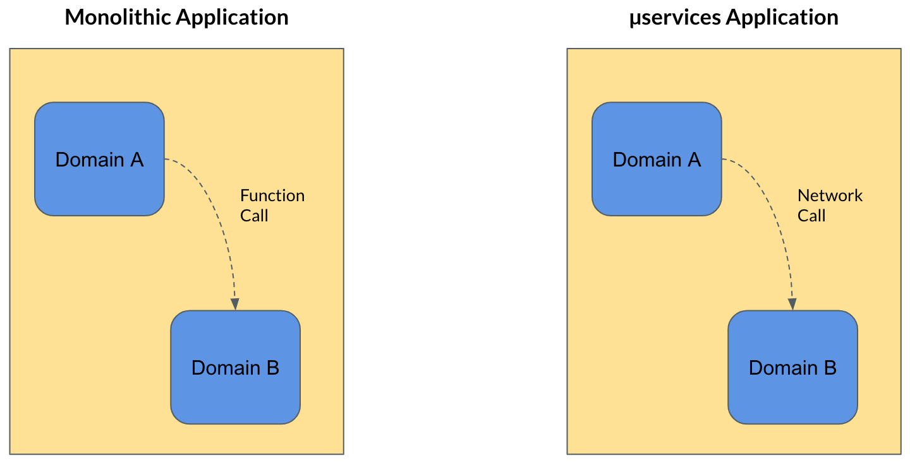
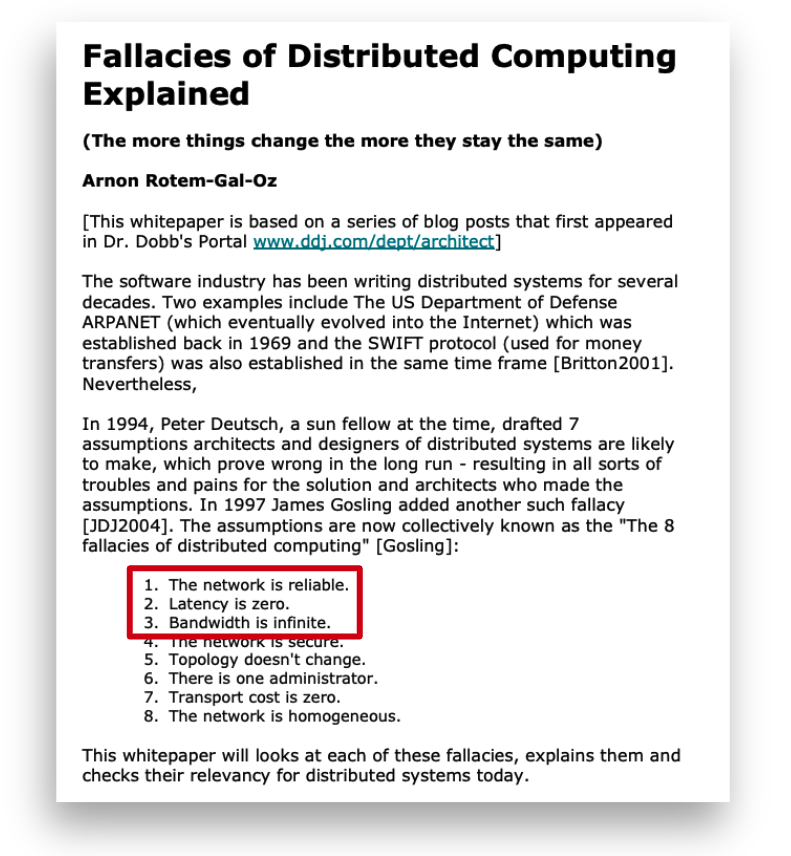
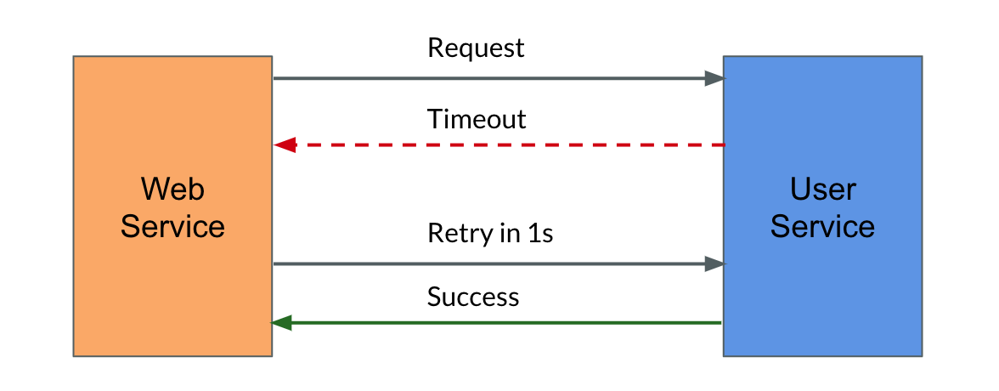
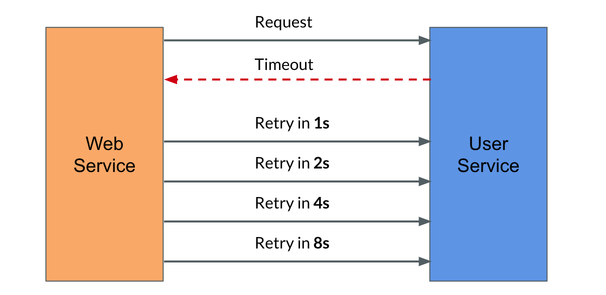
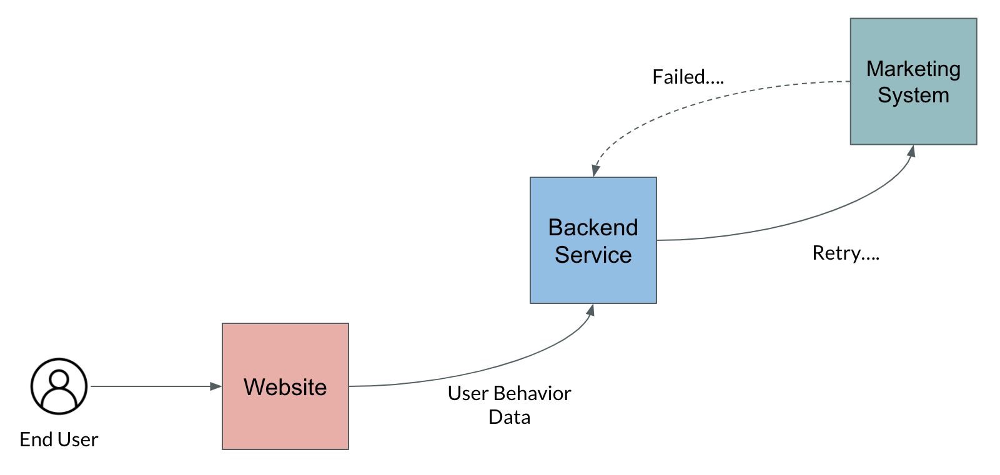
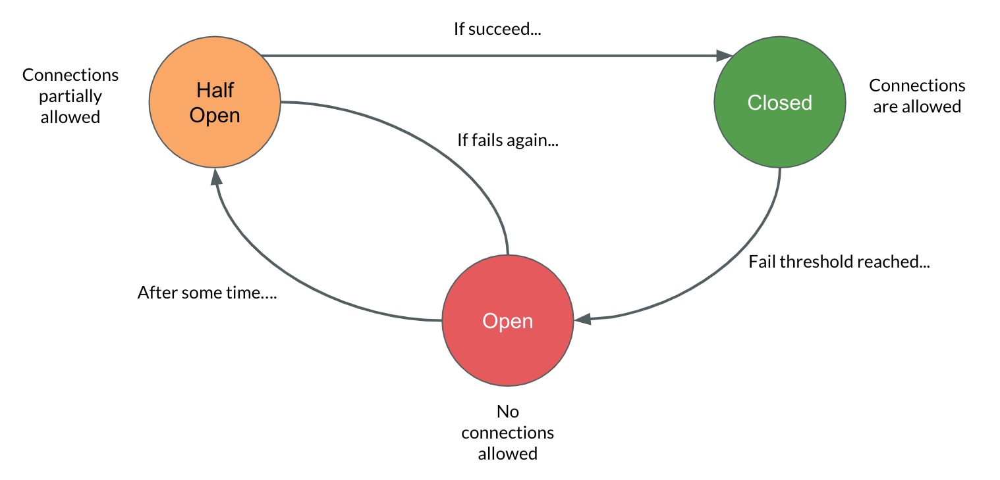

Transient faults are temporary failures that happen in a system for a short period. After some time it recovers automatically without any human intervention. For example, consider you're actually consuming a particular service, and the service might not be available, it might be very busy at that moment. And it might return you a failure response. After sometime, if you try the same request, it might succeed. 

  

It might sound silly, but it is actually real, this can happen. AWe need to now think about why handling transient fault is very important to the system design. Earlier everything was monolithic. If one domain wants to communicate to another domain, the communication has to happen through a local function. So there is nothing to worry about latency or reliability. But in case of a micro services application, a domain has to communicate to another domain across the network. And that's where all the challenges comes into place. 

  

Because we all know the fact that, 

> Network is unreliable 

And the reason that I'm saying that network is unreliable is even now you can go to your internet browser and do a speed test. There are a lot of websites that will provide that option, right. You can just go ahead and do a speed test, it will tell you some 50 Mbps speed maybe. But after five minutes, if you try the same speed test again, it won't give you the same result. The reason is - network always undergo a lot of fluctuations and its reliability is influenced by several factors. 

  

This is one of the popular paper about distributed computing. This paper is actually talking about eight wrong assumptions an architect can have while doing the system design. If you look at the first two, three points, they are all talking about the network reliability because in distributed computing, network would become the major source of transient faults. 

## Retry

Consider, for example, we are designing an e-commerce platform. The user has to update some kind of contact information in the system. So internally the website is actually raising a request to the user service. And for some reason, the user service is not available and it is busy, so it returns a timeout response. So now at this moment, we have to think about how to handle that failure. There are two approaches - either you can just throw the error to the user face and say the system is not available now and you can try it later. Or you can actually handle the retry internally. Then you might be able to provide a success response to the user. 

  

## Exponential Backoff

And one thing that we have to note here is not every time we will get a success response after the first retry itself, there is no guarantee like that. So we may have to configure the system in such a way that it has to do multiple retries and then it gets a success response. So, while doing the multiple retries, there are several things that we have to consider, because the problem is, whenever service raising a request to the target server to process the request, the target service has to consume some amount of CPU and memory. And when the target service actually return a response, I mean, after it closed the connection and return the response, it's not going to release the CPU and memory immediately, it will take some time to release the CPU and memory. If we keep retrying for every 1 second, the target service is going to consume a lot of resources, and it is going to put the whole system in trouble. So there are a lot of patterns around it how to solve this problem. One common pattern is, instead of having a static retry interval, we can increment the retry interval exponentially. For example, do retry in 1 second, and then increment to 2 second, and then 4 seconds like that. This pattern is actually called exponential back off. This will let the target service to release the resources, it gives enough time for the service to free the resources.

  

Another thing we have to consider is what kind of retry pattern to adapt, and how many, and what is the limit of retries that we should keep in the system, because we can't just do the retries indefinitely. So there must be some limit in the number of retries that we can do. This decision again depends on the business requirements and the needs. 

For example, in one of my project, we have a requirement like the user will be browsing the website. And from the background, we actually have to collect the user behaviour, we have to track the user behaviour and send that information to marketing system for some analytics purpose. The challenge here is the marking system might respond with the failure code sometimes. So we actually implemented a retry logic where the back end service will continue to do the retry, and then it will try to push the data to the marketing system successfully. So here, the thing here is the user is actually not waiting for any response from the system. Actually, the user don’t even know there is a background job running something like that and is actually collecting the data, except he clicked the *Accept Cookies* button. 😆 So it is totally okay to have large number of retries here, because the user is not waiting for any response. But in case if the user is actually waiting for the response, we have to carefully consider the pattern and the number of retries that we have to do because we may let the user wait for a longer time. 

  

In that case, we may have to return a failure code or a fallback response to the user. Another important thing to consider during the retries is, we should make sure that the retries are idempotent because some HTTP endpoints like POSTs are not idempotent. If you do a lot of POST retries, you might end up duplicating the data in the database. So that is something to consider. 

  

## Circuit Breaker

Another common pattern to handle the transient fault is circuit breaker. This is one of the sophisticated pattern to handle the transient faults. The name circuit breaker actually comes from the field of electrical field. In case if there is a huge sudden spike in the electricity flow, the statute actually automatically opens so that the electricity flow doesn't damage the other parts of the system. That's the whole point of circuit breaker. We can actually apply the same concept in the software design as well. There are two reasons why we need circuit breaker to solve problems. 

One thing when the target service is responding with failure code, the service will do a lot of retries. But what if that is not a transient fault? What if it is a permanent failure? So your service might be doing a lot of requests again and again and it might put the whole system in trouble.

Another important thing to consider is when you raise the request to the target service, it will take a considerable amount of time before it gives you a timeout response. That is one of the irritating thing, that you have to wait for so long time and then it will say it failed. So instead of waiting for longer time To fail, why can't we fail fast. That is the whole concept of circuit breaker. Circuit breaker actually works like a state machine, it has three states one is half open, closed and open. Closed is the default state of a circuit breaker, which means you allow all the connections to go through. In case the target service returning the failure response and if it reached the failure threshold, it automatically move to the open state. In open state no connections are allowed. After some configurable time, it will move to the half open state which means it allows limited number of requests to go through and it checks if the target service is returning a failure response. If the service is returning a success response then it moves the state to the closed state which is again the usual state, where it allow all the requests to go through. But in case if the target service is returning a failure response, it goes to the open state where no connections are allowed. 

  

This is another sophisticated method to handle the transient faults. And again, you don't have to implement the pattern from the scratch, you don't have to reinvent the wheel, there are a lot of tools and libraries available, which actually implemented the logic. We have to understand the underlying concept and we should be able to configure the values according to the business needs.
