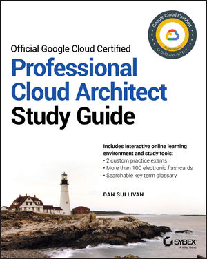
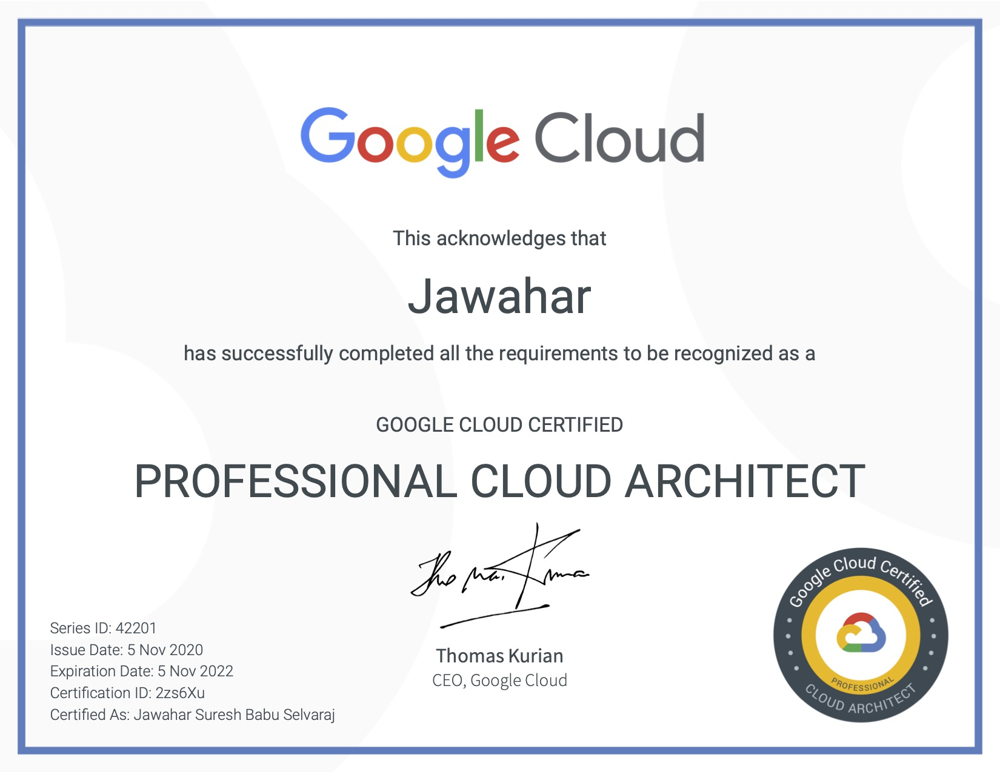

I started practising Google cloud platform couple of years back, working mostly with Google Kubernetes engine and other few services like compute engine, networks and firewalls. Though I had a considerable amount of experience in software development, cloud computing was one of my new areas to explore. During this period I had the chance to work with AWS as well, but I liked Google cloud because of its simplicity. My initial plan was to spend a week to prepare and take the exam. (Very bad idea 😭). But I end up preparing for 4 weeks before taking the exam. In this article, I am sharing my experience and the learning materials I used while preparing for the exam. 

## Learning resources

Google's official page for Cloud Architect certification covers the actual exam guide. It is good to go through it and understand what exactly Google expecting from us in this exam. Google also suggests few learning materials to use to prepare for the exam. But in this article, I will talk about what I have used in my exam preparation. 

### Official Google Cloud Certified PCA Study Guide

This is a very good starting place to prepare for the exam. The book does not only help you to prepare for the exam but also help you to understand the core services available in GCP if you are a beginner. The book comes with a question bank with more than 300 sample questions to prepare. Though these questions do not represent the actual questions in the exam, it helps us to validate our understanding of the concepts learnt.

### Coursera / Pluralsight

Pluralsight and Coursera have several courses related to Google Cloud Platform which helps in understanding core concepts. It also has some GCP PCA exam-specific courses, which guides us exactly from the exam perspective. In my experience, I felt like both Pluralsight and Coursera courses are almost similar and looks like the content is curated by the same team. So preparing either one should be more than enough. I used Pluralsight since I already had the subscription. While doing these courses, it is highly advised to take the hands-on labs. If you are new to GCP platform, taking those hands-on labs would really help to answer some deep technical questions in the exam.

[PluralSight Course](https://www.pluralsight.com/courses/preparing-google-cloud-professional-cloud-architect-exam-update)

[Coursera Course](https://www.coursera.org/learn/preparing-cloud-professional-cloud-architect-exam)

### Linux Academy

This is one of the best learning material compared to any other resources. The whole course is curated clearly from the exam perspective and each and every statement in that course is important as it is connected directly to some questions in the exam. They also included several hands-on labs, and it is highly recommended taking those. I have seen two courses in Linux Academy related to GCP PCA and I felt both are useful. 

[Google Certified Professional Cloud Architect 2020](https://acloud.guru/learn/gcp-certified-professional-cloud-architect)

[Google Cloud Certified Professional Cloud Architect (LA)](https://acloud.guru/learn/73e7ac67-e0f4-4cb6-ab6f-5e2bf7f22a04)

### Google Cloud Official Documentation

[GCP Documentation](https://cloud.google.com/docs)

Finally, Google's documentation around GCP itself is a great resource for preparing this exam. I know it's huge, but I would recommend going through the core concepts and best practices section of each service at least once. Because I have seen that answers for many questions are hidden inside the best practices documentation. For example, using indexes for Google Datastore/Firestore.

## Case Studies

Google offered three case studies for the exam, and it covers around 5 to 10% of questions (it may vary). It is good to learn and understand (not memorize) all those case studies prior to the exam as you may not have enough time in the exam to go through it. Google curated these case studies very smartly as each case study presents unique business problems, and they make sure the solutions cover most of the GCP services. You can read the case studies in Google official exam page to understand the details, but I covered the high-level view of each case study here.

### [Mountkirk Games](https://cloud.google.com/certification/guides/cloud-architect/casestudy-mountkirkgames-rev2) 

The business here requires an online game with a global presence. This case study is mostly around utilizing GCP's computing power and autoscaling options. This tests your ability in designing the compute resources in such a way that it will autoscale (MIG or GKE) and serve requests with low latency around the globe (Global LB). It also talks about analytics platform. Remember the game writes several statistics data in time-series fashion (BigTable or BigQuery) and it needs to be analysed (BigQuery/DataStudio) for future game improvement as well.

### [TerramEarth](https://cloud.google.com/certification/guides/cloud-architect/casestudy-terramearth-rev2) 

This case study is all about DATA. The ultimate goal of the business is to get the data to the users as soon as possible so that it can be used to understand the usage of the vehicle. This case study test our ability in designing an efficient data pipeline system that ingests (Pub/Sub) and process (Dataflow) the data as fast as possible in real-time. Some questions around this case study might talk about machine learning since one of the business problems is to pre-order the vehicle parts based on vehicle usage.

### [Dress4Win](https://cloud.google.com/certification/guides/cloud-architect/casestudy-dress4win-rev2) 

This case study is mostly about migration, transition and managing hybrid cloud environments. The case study says they want to do a complete migration to GCP, but first, they only want to start with DEV, QA and DR environments. So for a considerable period of time, their system has to co-exist in both GCP and on-premises. This makes the design more challenging since the same code and design has to run in both on-premises and GCP. So the transition includes identifying equivalent services in GCP that incur less change in the existing system. For example, on-premises compute servers to GCP virtual machines, MySQL to Cloud SQL, Hadoop/Spark to Dataproc, etc. They also may test in areas on, how to transfer data between on-premises and GCP through private connections and how to do a production environment migration without downtime.

## Closing

- The good thing about GCP PCA exam is that Google not only tests our ability in using GCP services but also in general system architecture patterns. Keep in mind, some of the questions do not require a GCP product to be involved in the answer. This also makes the exam more challenging, since the scope or boundary of the exam cannot be defined clearly.

- All the questions in the exam are scenario-based. I didn't see a single question like -  What service to be used for high-speed data ingestion? Instead, they will present a real-time scenario and we need to pick the right service considering all the business problems and the best practices. Each and every word in the question is important. For example, a question like - A customer wants to use a relational transactional database in a cost-efficient way. What would you suggest? And the options may include Cloud SQL and Cloud Spanner. Both can be used to solve the problem, but the answer should be Cloud SQL as cost-efficient is the keyword here. (Cloud Spanner is really and seriously expensive !!! 😲)

- Hands-on labs are really important to prepare for the exam. Qwiklabs and Linux academy offers the best environment for hands-on. Google also offers a year of $300 free credits, where you can play with all the GCP services for 1 year.

- There are two modes of exam - onsite or online. (Most of the enterprise certifications now follow the same). I took the onsite proctored exam and I would highly recommend the same since online proctored has a lot of restrictions like - you need an empty room, nothing on the table, always show face in the camera, no external monitors and so on. And internet connectivity is another challenge. If the internet goes off in the middle, your exam might be submitted with partial progress (still a minute outage is OK I guess, but not sure). So it is better to find a nearby Kryterion centre and take the exam. Wear mask. 😷

- The exam result does not present any score, it just says whether you are Pass or Fail. So if you fail, there is no feedback on which area to improve. So preparation is the key.

- It is also recommended to take the Associate Cloud Engineer certification first if you are quite new to GCP, but it is not mandatory at the same time.

Hope this helps. Let me know in comments if you have any other thoughts or questions. Good luck.

