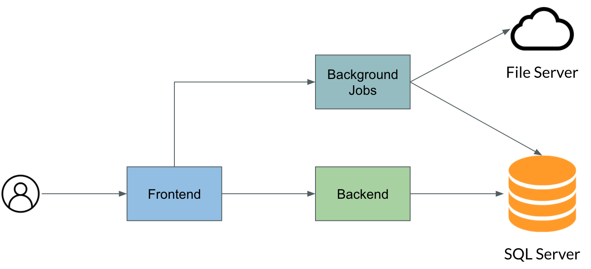
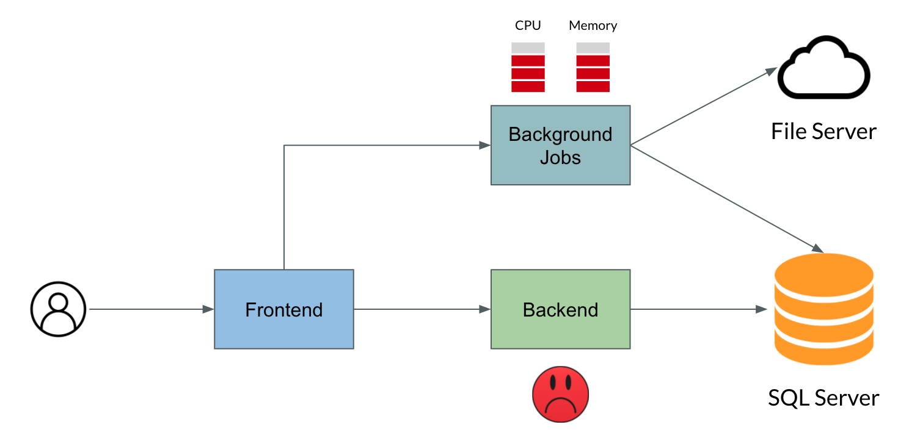
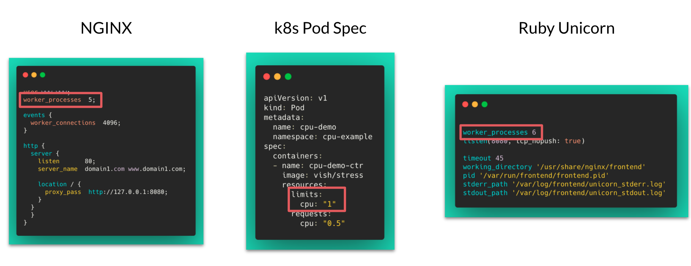
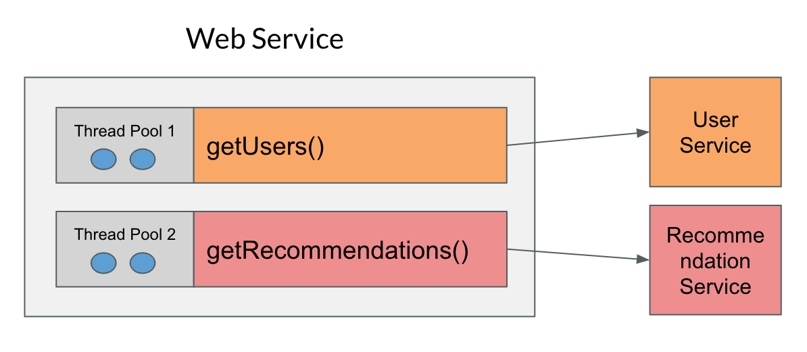
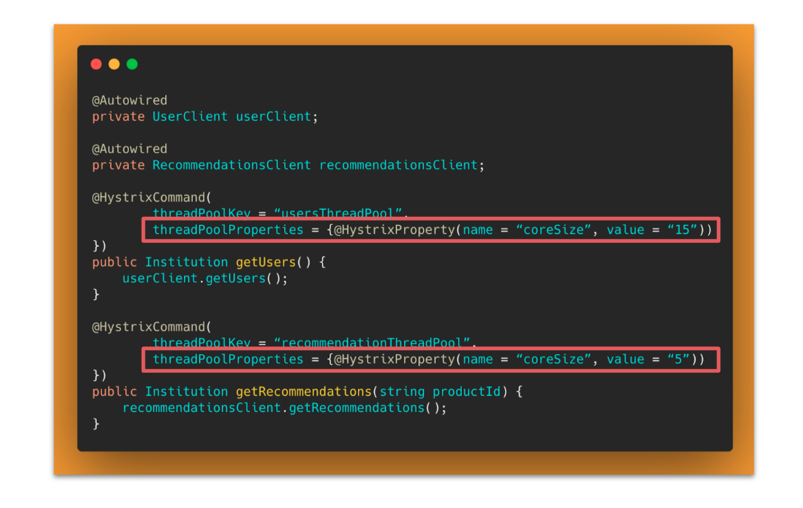

Isolation is the process of containing the components in a system so that any failure that happening to one part of the system wouldn't propagate to the other part of the system. So basically, we have to contain the failures in a specific region within the system. So this concept can be achieved with the pattern called bulkhead pattern. 

## Bulkhead

  

So this name bulkhead pattern arise from the concept of ship building. In case of ship building, they built multiple compartments within the ship, so in case of any hole appears in the ship and the water gets into it, the water will be contained within a particular compartment, it won't propagate to the other regions of the ship. That is the whole concept of bulkhead. And the same can be applied to software design as well. 

You might wonder how failure in one system can propagate to other parts of the system in software system right? I'll explain that by talking about one of the incident that happened to my project a few years back. Some 3 to 4 years back, I was actually working on a .NET project. It was an automobile dealer audit system. Our client was actually one of the most established automobile manufacturer. And they have dealers all around the country. So the auditor has to go to the dealer's location and they have to validate all the documents, the invoices, the sales, the pricing and the discounts on everything. So we basically build a web application, which actually pulls the data from multiple dealers, and then store it in a local database. Auditor can just sign in to the application and they can explore and validate the data. So the application is all about number of data tables with some advanced search capabilities. The architecture of the application is straightforward. There is no micro services pattern or something. It was a simple monolithic application with the front end back end, and the database layer. And it was not even deployed in cloud, it was deployed in on premise infrastructure. The machine configuration is also average - one CPU and a 4 GB RAM, it's not even a dual core. 

In this case the user actually requested another requirement in the system, which is the user should be able to download some reports from the application. The challenge here is, it's not just a static report they want to download, it has to be dynamic. So whenever the user actually requested for a report, the system has to pull the data dynamically from the database, and then it has to construct the report. It could be PDF or excel, and then it has to upload the file to some kind of a file server, and then send a notification to the user back saying that the file is ready. Then the user can just go ahead and download it. The whole process was asynchronous, the user don't have to wait for the report to be generated. They can just raise the request, and then they will get a notification later saying, that the report is ready. 

  

So everything is done, we released the application to the production, everything went well. But after some days, users started complaining that the application is slowing down. And they specifically said that the application is slowing down only ~sometimes~. And that sometimes is the biggest challenge to us. Because you all know that right? If QA reported a bug, and if they say that the bug is reproduced only sometimes, then that will become the hardest issue to fix 😅. That is exactly the same thing happened in our project. The users were saying that the application is performing good sometimes, and slowing down sometimes. So we started looking into the issue. 

Our first suspicion was the database queries, because the database actually has millions and billions of data. And we have to query all the data, and produce the results to the users. So we thought that the queries may be inefficient, and that's when the system is slowing down. But the thing is, that cannot be the case, because we were not writing any native SQL queries, we actually used a ORM. We used Entity Framework and it is one of the most popular and performant ORM for .NET. So we don't have to write any kind of native SQL queries. So you just have to write the query in the programming language itself. And the Entity Framework will take care of converting the language integrated query (LINQ) into the corresponding SQL queries. And the good thing about EF is that it actually optimise the query as well. So there is no way that the queries are actually slowing down the system. 

And then we started looking into the logs. Biggest challenge here is the logs were distributed everywhere in the system, we don't have any log aggregator installed in the application. So every process has its own set of logs, so we actually took the backend service logs. And then we compared those logs with the background jobs logs. Then we figured out that the request response for the backend service is longer only when the background job is running. We figured out that the background job is definitely the culprit here. What exactly is happening is whenever the user is requesting for a report, the background job started running. And then it started consuming all the CPU and memory, leaving no resource for the back end service to consume. And that is the moment the whole application is slowing down. 

  

## Resource limiting

This is where the isolation actually comes into picture. Ideally, we should isolate the resources for the background jobs and backend services. So that if anything happens in the background jobs, if there is a huge load on the background jobs, it shouldn't impact our back end service. So it is always a best practice to enforce the resource limitation to the process that you're running in any situations. Below you're just seeing the examples of how to enforce the resource limitation to various process. 

  

And one more thing is that this isolation can be implemented in process level and also at the function level. For example, consider you have a micro service based application - we have a web service instance and it has to talk to user service and recommendation service to get the recommendations. Now we have enforced isolation for the whole process. So we allocated some particular number of threads to that process. But in case, if the `getUsers()` function gets invoked a lot of times that function itself might end up consuming all the threads. And it won't leave the `getRecommendations()` functions to not use of any the threads.

  

So we should have design the system in such a way that these functions are invoked regularly by using the threads from the corresponding thread pool. And in case if it is running out of threads, that particular function should fail. It shouldn't impact any other functions running in the system, the failure should be contained within that particular region. There are a lot of tools and frameworks available to enable this configuration.

 

- [Hystrix](https://github.com/Netflix/Hystrix)
- [Resilience4j](https://github.com/resilience4j/resilience4j)
- [Polly](https://github.com/App-vNext/Polly)
