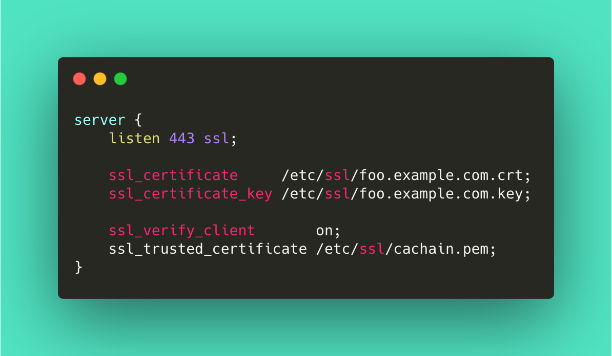

NGINX is an open-source web server that powers more than 400 million websites. In this article, I try to explain some of the core concepts of NGINX using real-life scenarios. 

Alice got a new job as a receptionist in an insurance company.  Her responsibility is to greet the customers and listen to their requests patiently and address them. She is the face of the company to customers. Alice was excited about her first day.
## Reverse proxy
Alice got her first customer Bob. Bob wanted to enquire about the late fee for his last premiums. Alice got the required details from Bob and asked him to wait in the lobby. Alice then went inside the office and talk to several officers and verified a few records and made few phone calls and finally, she came back to reception. She informed Bob about why he got late fees in his premiums. But Bob had a few other questions as well. Alice patiently listened to each request and went inside the office, talk to the officers, and addressed his requests.

Bob got curious. She asked Alice, why don't you let me inside, I go to officers directly and talk to them, verify the records and I can clarify all my questions. Alice refused. She knows why it is not the right way. Because that might expose the operation details and officer's identity of the company to outsiders and that might compromise the security.

**What does that mean in NGINX?**

In a typical microservice architecture, multiple services work together to serve a request. NGINX knows to which backend service to be contacted to serve a particular request. Each microservice might be running in a different port, protocol, and host. NGINX exposes a single gateway to outside through which the external users can reach the application, thereby abstracting the internal implementation to outsiders.

## Load Balancing

One day, Alice got instructions from the company that said, that officers of particular departments cannot handle more requests at the same time.  That makes them tired and that impacts the overall performance of the company. So the management appointed additional officers in the same department and asked Alice to share the job across multiple officers in the same department. Alice decided to reach out to officers who have a lesser workload sometimes she assigns in round-robin fashion.

**What does that mean in NGINX?**

Each microservice might be running as a server accepting requests through a specific protocol. The more requests a server handles, the sooner it might get slower because the CPU consumption might get increases as with more requests. At some point in time, the server might stop working and it impacts the overall application's availability. So it is a best practice to run multiple instances of the same service to ensure high resilience. And NGINX takes the responsibility of sharing the work across multiple instances. NGINX uses several approaches to decide which instance to reach - a basic round-robin, or least requests in the queue or configurable weight-based.

## Concurrency

The company started gaining more reputation and that increases the number of daily customers. Like other officers in the company, Alice also started feeling the pressure. She got complaints saying that customers have to wait for a long time to get their problems resolved. Usually, Alice takes one customer request at a time and get into the office and deal with it. During this time, the other customers have to wait in the queue. 

To avoid this management came up with two solutions.

1. When Alice gets a customer request, she has to find the corresponding department and hand over the request. And she shouldn't wait for the department to finish the requests. Instead, she should come back to the reception immediately and collect the next request. If the department completed processing the first request, Alice should collect the details and hand over it to the first customer. Yes, Alice has to keep track of the customers and their requests, but this approach reduces the wait time to a greater extent.

2. Appoint more receptionists to handle more customers. This needs to be done with care though. Just increasing the receptionists to large numbers might put some of them into an idle situation since the officers will take some time to process each job. The number of receptionists has to be increased by keeping the officers' capacity in mind.

**What does that mean in NGINX?**

NGINX uses non-blocking IO to handle incoming requests. In a typical blocking connection, it has to wait for the response before it initiates a new connection to backend servers. Also, the typical web server follows the thread-per-request model, where the requests go to the waiting queue as soon as it runs out of available threads. The requests can only be processed when any one of the thread becomes available. But in NGINX, a single worker thread can handle multiple requests using the non-blocking model.

The number of worker threads can also be configured in NGINX. But the best practice is to keep the number of workers equal to the number of cores. If you cannot find the number of cores in your machine, it is better to leave it to NGINX by setting the value to `auto`.

## SSL Offload

Alice recently realized that the insurance company and customers sometimes share information and documents through postal (yes just assume that email wasn't invented yet 😊). The documents sometimes contain user sensitive information. To protect that data from stealers, customers and the company usually seal the documents with material that cannot be easily tampered. Now the problem is, every time the company receives some documents, officers have to spend a considerable amount of time to unseal those envelopes (remember we said that the material is stronger 😊). Now Alice decided to solve this problem by taking the responsibility of collecting the documents from a sealed envelope. She seals the documents when it goes from the company to customers and she unseals the documents when she receives it from customers. That makes the job easier for officers so that they can focus on their core jobs.

**What does that mean in NGINX?**

It is always a preferred approach to use a Secured HTTP protocol (SSL) for client-server communication. With this protocol, any data that transferred between the server and client will be encrypted. The client keeps the public key and the server keeps the private key. Whenever the server receives the request it needs to decrypt the data using the private key before it starts processing it. The challenge here is that it requires more processing power for encryption/decryption of data. So this might impact the performance of the server and so the overall application. NGINX solves this problem by taking the responsibility of removing the SSL based encryption from incoming requests.

---

Hope the above real-life comparison helps to understand the concepts easier. (The example scenario might not happen in real life as explained here. This is just to help readers understand NGINX better.) 

Thanks to [Comicgen](https://gramener.com/comicgen/) and [Carbon](https://carbon.now.sh/)
