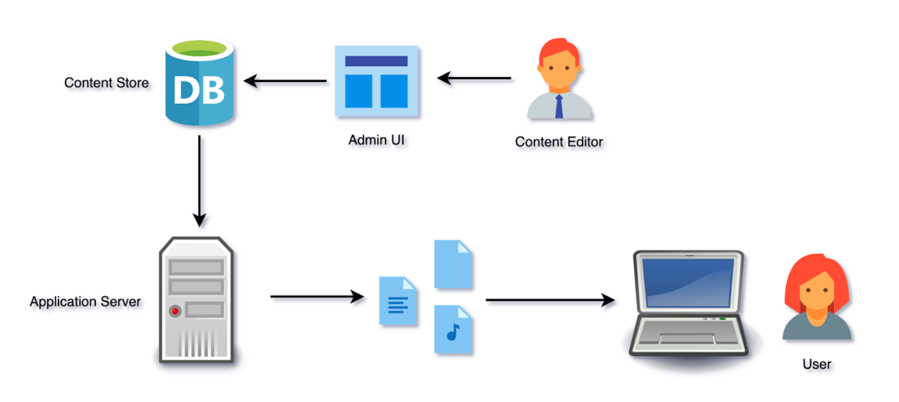
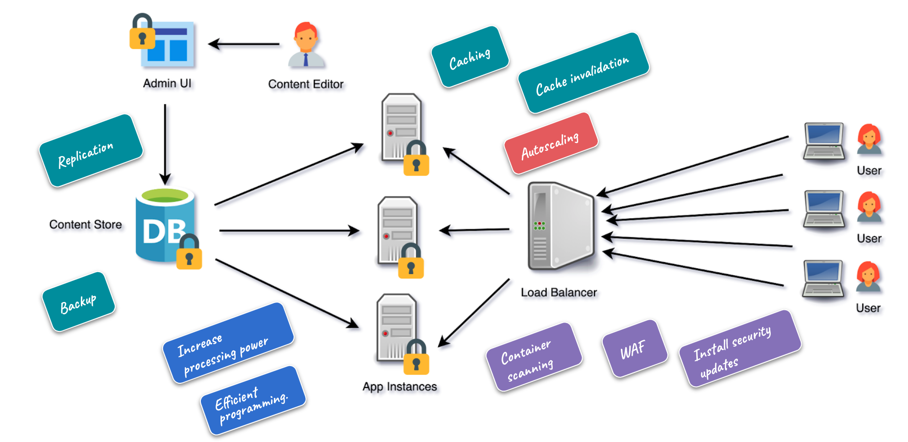
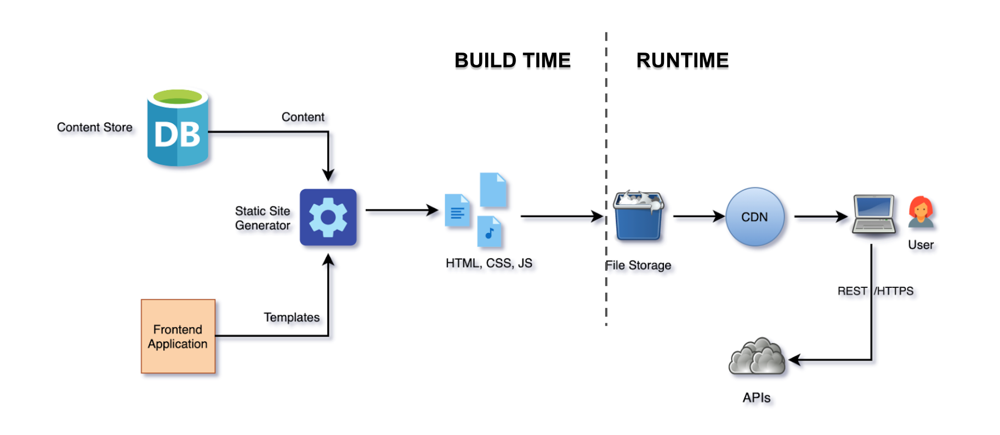

All these days, web development has gone through several changes and improvements. Days are gone, when HTML, CSS and JS are hand-curated and deployed into a static storage server through FTP. With that approach, each HTML file might represent a web page and share common stylesheets and scripts. The approach sounds legacy and it is way outdated compared to the modern web development approaches. But the performance of that approach is incomparable. HTML files are readily available at the time of request and do not need any dynamic computation.  
  
But coupling content and presentation causes several other issues, including that the content/marketing team cannot operate independently without a development team. The need for a content management system arises and the database comes into the picture. Content gets stored independently in the database and a web service pulls the content from the database and constructs the HTML pages at runtime. A traditional LAMP-based web application looks like this.  
  
  
  
##Current Challenges  
  
There are several challenges associated with this traditional approach, though this is one of the common web development approaches nowadays. A website needs to be faster, secured, and scalable. Let us focus on how this traditional approach addresses these needs.  
  
Browsers are evolving, mobile networks have improved a lot and users are becoming impatient. It is a must for websites to load faster than ever before or users are going to just abandon your website and move forward. Google considered website load time as a critical factor for search ranking. Facebook also announced that it will prioritize links that load quickly in its news feed over the ones that are slow to load.  
  
  
  
  
**Performance** can be improved in a web application through various techniques. HTML pages are getting constructed at runtime and a database request is needed for every user request to the web page. Increasing the computing power of servers like CPU and memory would help. Also introducing caching at several levels might increase the load time of a web page.  
  
**Security** is another challenge. With database and application servers running, it is necessary to make sure all the security patches are up to date and firewall rules in place to avoid any breaching. It was a well-known fact that millions of websites were compromised in 2014 due to a [security flaw in Drupal](https://cyware.com/news/what-is-drupalgeddon-and-what-kind-of-targets-does-it-go-after-78f558ec/). The so-called '***Drupalgeddon***' vulnerability could have easily led to the exploitation of any systems running the vulnerable code.  
  
Web applications are supposed to be **scalable**, especially when it comes to public-facing e-commerce or marketing websites. When a marketing website starts a new campaign or an e-commerce site starts a big billion sale, the infrastructure should be flexible to support the high traffic. The strength of the infrastructure would be challenged not only by genuine human traffic but also through DoS (Denial of Service) attacks. Continuous monitoring is required to handle such problems and infrastructure needs to be scaled up and down as required. Autoscaling can be implemented through orchestration services like Kubernetes, but it comes with its complexity and other challenges.  
  
So very soon a LAMP stack based web application turns into something like below with more **infrastructure maintenance** nightmare. All of sudden continuous monitoring and security updates become non-trivial.  
  
  
  
**Developer Experience** is another important factor to consider. With the advancement in the Javascript ecosystem, several modern frontend javascript frameworks have been evolved to make the developer life easier. But in traditional LAMP-based projects, developers cannot leverage the advantages of modern Javascript frameworks like React or Angular, since the backend and frontend are tightly coupled to each other. Though it is still possible by server-side rendering (SSR), it simply adds complexity and puts limitations on the backend tech stack.  
  
##What is Jamstack?  
  
JAMStack is a new approach to building faster and more secure websites. Unlike LAMP or MEAN stack, JAMStack is not a set of technologies to build a web application. Instead, it is a set of guidelines and best practices to describe a modern web development architecture based on   
  
- Pre-built markup  
- Client-side Javascript  
- Reusable APIs  
  
###Pre-built markup  
  
One of the primary downsides of the traditional web development approach is - it constructs HTML pages at runtime. The construction requires content to be fetched from a data store and build pages using a rendering engine. Think about a static website, no matter who requests the page or from where it requested, the site is going to display the same content. Constructing the page for every request makes it a processing overhead. Simply those the pages can be built ahead of time and just deliver it to the user when requested. Static site generator is not a revolutionary idea, it's been there for a long time. Hugo and Jekyll became so popular when Github pages landed. But websites are not just static.   
  
###Client-side Javascript  
  
Advancement in Javascript ecosystem enabled browsers to deliver a rich interactive web experience. I still remember when I started my career as a web developer a few years back, I hate Javascript so much. I consider it as a toy language - it can be used only to manipulate web elements. But the growth of Javascript in recent years has been astonishing. Modern frameworks like React and Angular made it possible to build enterprise applications completely using Javascript. The combination of pre-built makeup and client-side Javascript makes the web more powerful. But that’s not the end, the web still needs server-side processing. Think about a website that enables online payment, how about a CPU intensive logic that cannot run in a browser, what about data persistence.  
  
###Re-usable APIs  
  
JAMStack recommends server-side processing using APIs or serverless platforms like cloud functions. A website that needs to enable payment can use services like [Stripe](https://stripe.com/) or a website that needs search functionality can use [Algolia](https://www.algolia.com/). CPU intensive operations like image processing or document manipulation can be achieved using cloud functions. Microservice based architecture and serverless platforms are the future, so leveraging their advantages in web development makes the JAMStack even more powerful.  
  
The architecture of a typical JAMStack based web application looks like below,  
  
  
  
##  Why is JAMStack the solution?  
  
The above diagram represents an approach that solves the problem we discussed earlier. The entire architectural flow can be divided into build-time and runtime. There is no heavy computation happening in the runtime since the assets were pre-built and available to serve. Lack of servers in the runtime reduces security vulnerabilities to a greater extent. And with microservice-based APIs for server-side processing, it has less surface area for security attacks compared to monolithic platforms like Drupal.   
  
Delivering the pre-built markups through CDN gives amazing performance compared to any traditional web approaches. The build process still requires some servers to automate the process of building the assets as soon as the content gets updated. But those are not public faced and any security or performance issues in build time are not going to impact the end-users. Developers can also leverage modern tools to build applications. Frameworks like [Gatsby](https://www.jawahar.tech/blog/gatsby-in-a-nutshell/) and [Nuxt](https://nuxtjs.org/) provide the advantages of both modern Javascript frameworks and static site generators. The approach gives freedom to front end developers and makes them the inevitable part of the development team, unlike the traditional LAMP stack.  
  
JAMStack also recommends a few best practices like Git-based workflow, automated builds, atomic deployments and instant cache invalidation. Though JAMStack is a new way of building web applications and making it through web development recently, enterprise CMS products are also considering this in their package. For example, [Adobe Experience Manager](https://docs.adobe.com/content/help/en/experience-manager-64/developing/headless/spas/spa-overview.html) and [Sitecore](https://jss.sitecore.com/) have solutions to build web applications entirely using modern Javascript frameworks and build it ahead of time and enabling the option to deploy it in any cloud-based platforms like AWS S3 or Netlify. JAMStack has great potential in becoming the default approach for web development.  

## TL;DR  
  
[JAMStack](https://www.netlify.com/jamstack/) is a new trend in web development that tries to solve certain challenges in today's traditional approach. Approaches like the LAMP stack expect the system to build the pages for every request by fetching the content from the store at runtime. This puts a huge penalty in performance and security. JAMStack is not a framework or library whereas it is a set of practices to make web development efficient and easier. The use of pre-built markup along with client-side javascript and reusable APIs creates a new perspective on web development and helps to build faster, secure and scalable web applications.
