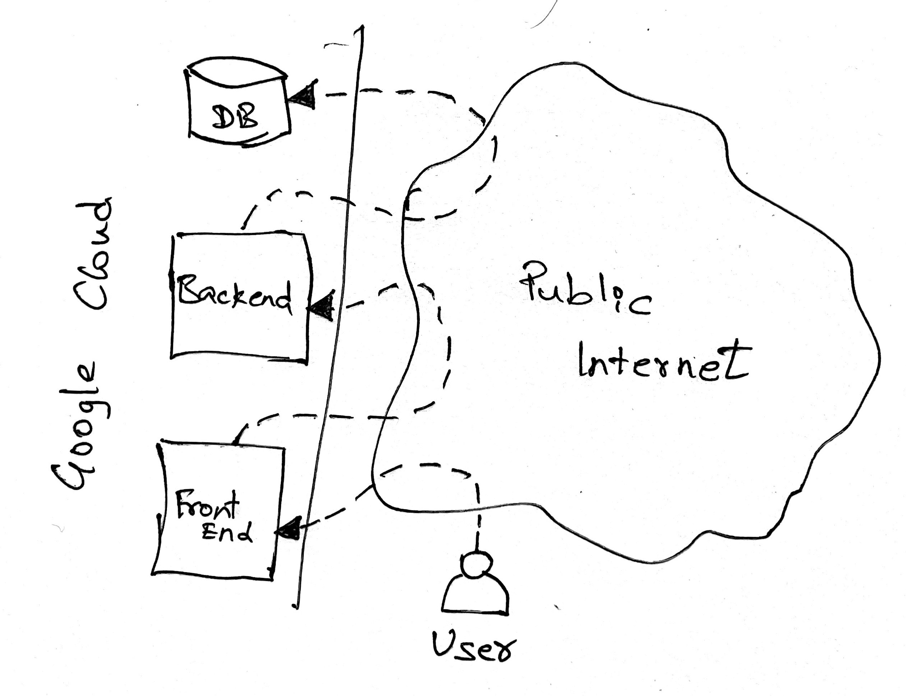
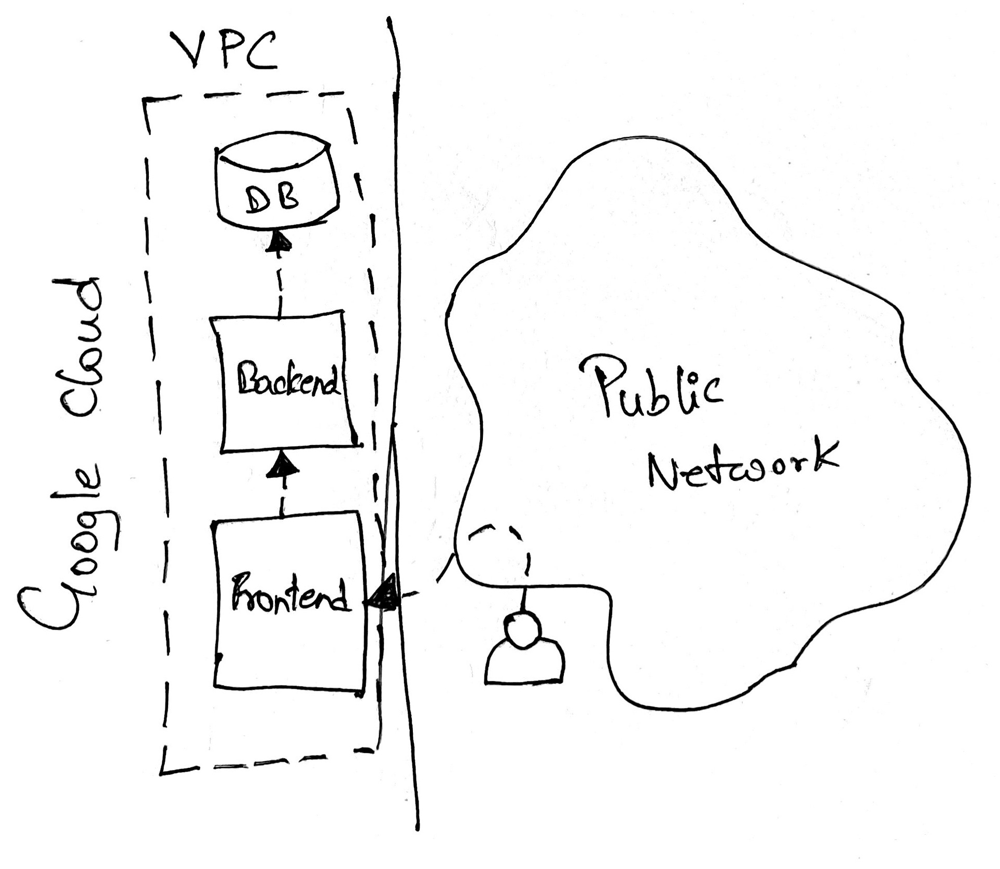
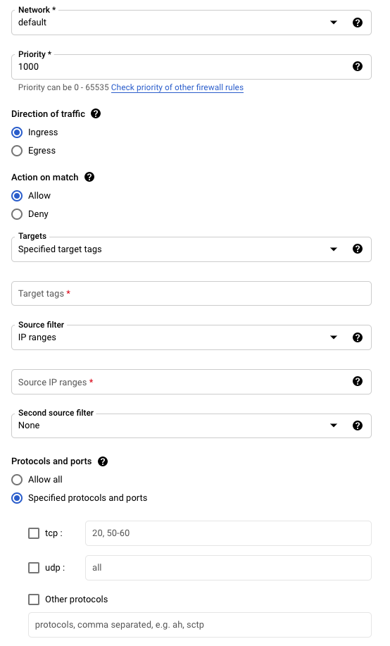

A software system is a collection of several components connected to each other. Networking is crucial in any software system. It’s highly important in system design to plan and implement, how the different hardware/virtual components connected to each other. It is also important to understand the difference between private and public networks. A private network is limited and accessible only to your system whereas public network or internet is available to everyone. Of course, you are reading this post through public Internet. Consider you have to connect a printer in your home. Or you want to connect your mobile and PC to share files. You just have to enable a private communication between these devices. It doesn’t make any sense to expose your printer into a public network and connect to it.

Google Cloud Platform offers a highly advanced managed service to manage networking - **Virtual Private Cloud** (VPC). As the name implies this is private network service offered by Google Cloud.

## Why VPC?
Consider we have to design a 3-tier web application - a front end, a back end, and a database layer. Fronted layer accepts incoming requests from users and forward it to back end and back end forward that to database. To achieve this, three virtual machines (a GCP service that offers virtual servers in contrast to hardware servers) can be created. These machines have to be connected to each other. Without VPC each machines has to be exposed to the public Internet and connected using external IP address. The following diagram describes the same.

  

The requests that flows between these machines has to go through public Internet every time, which introduce unnecessary latency, and it’s not secure as well. VPC service provided by Google is designed to connect virtual machines private to your GCP project without exposing your infrastructure resources to public. With this approach only the front end server has to be exposed to public Internet to accept incoming requests and other servers will be connected within private network and talk to each other.

  

The good thing about Google VPC is that a default VPC comes along with every new GCP project and has connectivity across the globe. Also, by default it has subnets created for each region.

Google takes care of creating these VPC resources automatically. Though it provides options to create custom VPC with custom subnets in defined regions, most of the times a default VPC serves the purpose. I still remember that I created and ran my first server in GCP without knowing anything about VPC. Google Cloud is known good keeping things simple.  This probably may not be the case in other Cloud providers. But understanding the GCP VPC in detail helps us designing the system better.

## Subnets

Subnets are logical division of large network. Consider you are sending a gift to me and how do you specify the address? If you mention it as **Jawahar, India** (never do this !!! 😅), just assume how hard it is going to be for the post person to find me. To make it simpler, you could say the address as **Jawahar, Chennai, India**. That makes the search limited to Chennai.  Similar to that IP addresses can also represent the subnets in addition to network and device.

  

The concept of subnets has nothing to do with GCP, it is a general networking concept. But GCP provide options to manage subnets easily. A default VPC comes with predefined subnets for each region. All subnets come with an IP range. We just have to make sure that IP ranges are not overlapping. To get more control over the networking, it is highly recommended creating a custom VPC and define the subnets as per your needs.

## Firewalls

Security is another important aspect to be considered in networking. When multiple components connect to each other, it's crucial to define who has access to what. GCP provides a handy way to define firewall rules. A firewall rule in GCP is composed of 6 key aspects. Let's understand each one.

  

### Network

A GCP project can contain multiple networks. So this field helps to specify which network, the rule applies to. By default, this would point to default network. I have encountered issues with firewall rules several times and realized the network is not pointing to the right one. So this field important to keep in mind, if you use multiple custom VPCs.

### Priority

This is to specify in which order the rules has to be applied. Priority can be 0 to 65535. Lower the number, higher the priority. To follow the principle of the least privilege it is recommended the block all communications with lower priority and enable required communications using high priority firewall rules.

### Direction

This is to define whether we want to control the ingress (incoming) or egress (outgoing) traffic. 

### Action

This defines whether you want to allow or deny certain traffic. Pretty straight forward. 

### Source / Targets

The target defines where the firewall rule should apply to. It could be either all instances in a specified network or applicable only to the instances with certain network tags. An IP range can be specified to control the source traffic. IP range 0.0.0.0/0 refers to public network.

### Protocols / Port

This defines what protocol we want to allow/deny traffic to. Say for example, if you want to block SSH access to virtual machines, specify the port 22. Similar to that other TCP ports ca also be specified like http (80), https (443), RDP (3389) and so on. It also supports UDP and other protocols.

By default VPC comes along with two implied firewall rules, one is to allow all egress traffic and deny all ingress traffic. Also it comes with 4 pre-populated rules in default network.

- Allow all internal traffic within a network. (`default-allow-internal`)
- Allow all SSH traffic to VMs from any source. (`default-allow-ssh`) 
- Allow all RDP traffic to VMs from any source. Remote Desktop Protocol for Windows. (`default-allow-rdp`)
- Allow all ICMP traffic to VMs from any source. To allow `ping` commands to work. (`default-allow-icmp`)

---

Google Cloud network services are powerful. Users get to use the same network infrastructure which powers Gmail, Google Search and Maps. Also, GCP is known for keeping things simple. You can deploy an application into GCP with limited effort in network and security features, since GCP provides a basic setup by default and provide options for advanced customizations.
